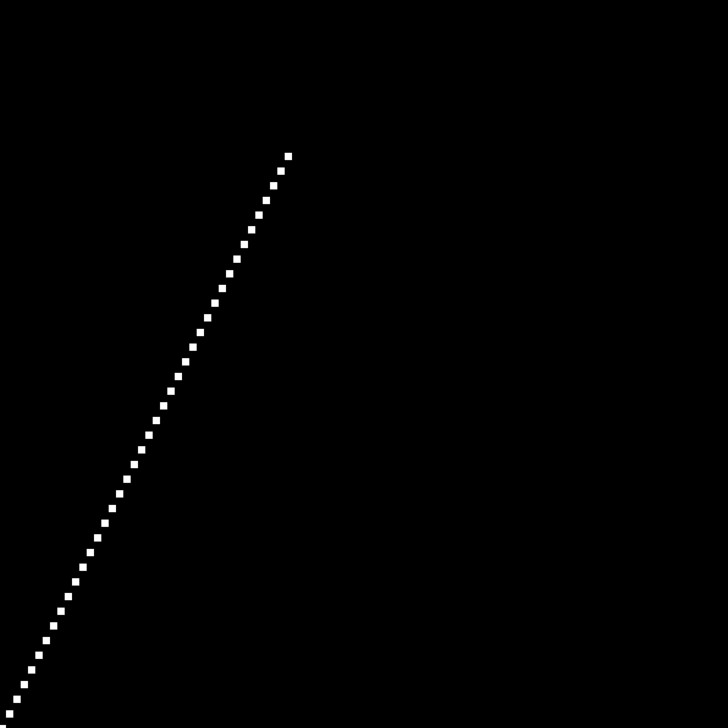
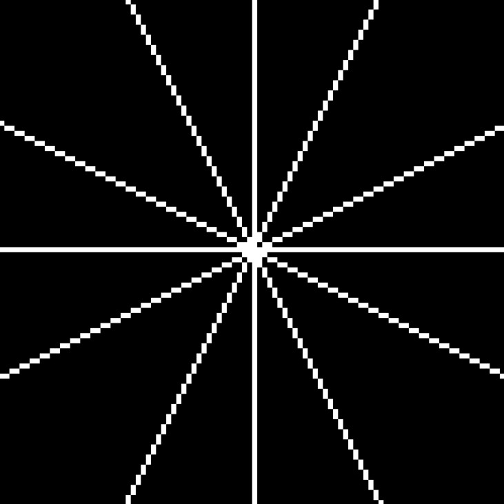
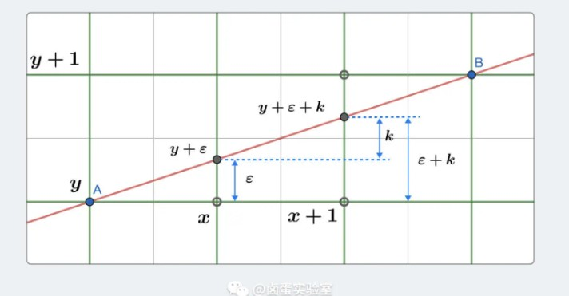
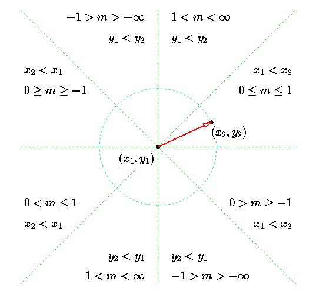
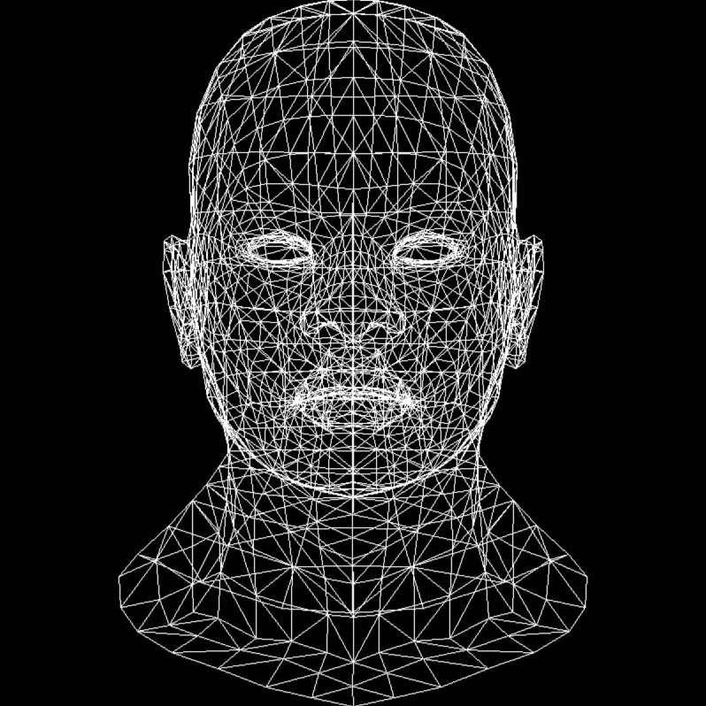

[TOC]

# TinyRenderer

## Lesson 0 - 前言

本文是**ssloy**大佬的[tinyrenderer](https://github.com/ssloy/tinyrenderer/wiki)教程的笔记,记录学习的相关知识点与开发过程.根据这个教程可以实现一个简易的`OpenGL2.0`(渲染管线只支持`Vertex Shader` 和 `Fragment Shader`两种自定义Shader),了解`OpenGL`这类图形学API在底层是如何工作的.

### 参考资料

- **ssloy**的[tinyrenderer](https://github.com/ssloy/tinyrenderer/wiki)教程.
- 卤蛋实验室[十天自制渲染器](https://supercodepower.com/docs/toy-renderer/index)
- 陆续添加(根据学习进度)

## Lesson 1 - 环境搭建

该教程要实现的是尽可能减少外部依赖,来实现一个渲染器;我们只使用一个可以对**TGA[^1]**文件进行编辑的外部依赖.
[^1]: TGA : 他是支持RGB/RGBA/黑白格式图像的最简单格式之一.

将教程中的`tgaimage.h`和`tgaimage.cpp`放入自己新建的空项目中,并创建`main.cpp`文件,完成最开始的项目创建.

```
// 项目文件结构
main.cpp
tgaimage.h
tgaimage.cpp
```

### 最初的绘制

然后我们创建一张100 * 100 的tga图片,并在其上画一个红点.

``` cpp {.line-numbers}
#include "tgaimage.h"

const TGA red = TGAColor(255,0,0,255);

int main()
{
    TGAImage image(100,100,TGAImage::RGB);
    image.set(52,41,red);
    image.flip_vertical(); // 图像的(0,0)在左上角,竖直反转使(0,0)点位于左下.
    image.write_tga_file("output.tga");

    return 0;
}
```

运行程序,找到并打开`output.tga`[^2]文件,如果点成功绘制,说明我们成功完成了学习前的配置.
[^2]: tga文件`Windows`并不能直接打开,这里我使用的是[GIMP](https://www.gimp.org/).


## Lesson 2 - 直线绘制

### DDA直线算法

DDA直线算法是一种基于直线的**微分方程**来生成直线的方法，利用**斜率**和**截距**来确定每个像素点的坐标.

#### 简单实现

在平面表示一条直线,最常见的就是**斜截式**

$$ y = kx + b $$

k:斜率  b: 直线在y轴的截距

**斜截式**在数学上的应用是没问题的,但在实际的项目中,因为硬件资源的有限,我们**不可能也没必要**绘制无线远的直线,通常情况下我们只会在空间中绘制一个**线段**.

线段往往是已知的**起点**(x1,y1),**终点**(x2,y2);这种时候**两点式**是表示直线最方便的方法了.

$$ \frac{y - y_{1}}{x - x_{1}} =  \frac{y_{2} - y_{1}}{x_{2} - x_{1}} $$

稍作变形

$$ \frac{x - x_{1}}{x_{2} - x_{1}} =  \frac{y - y_{1}}{y_{2} - y_{1}} $$

我们可以使用`e`来表示等式左侧和右侧

$$ \left.\begin{array}{l}
x=e\left(x_{2}-x_{1}\right)+x_{1} \\
y=e\left(y_{2}-y_{1}\right)+y_{1}
\end{array}\right\} 0 \leq \lambda \leq 1 $$

`e`我个人将其理解为绘制直线的进度`0.0 ~ 1.0`

这个时候我们只需要从0开始取值就可以获得对应的点.

``` cpp {.line-numbers}
void line(int x1, int y1, int x2, int y2, TGAImage& image, TGAColor color)
{
    int dx = x2 - x1;
    int dy = y2 - y1;

    for(float e = 0.; e < 1.; e += .01)
    {
        int x = e * dx + x1;
        int y = e * dy + y1;

        image.set(x, y, color);
    }
}
```

直线算法的初步实现就完成了,但只能说*等用*,地位与*冒泡算法*类似,能用但性能不行.

- 每画一个点都要运行两次乘法.
- 大量的浮点运算
- 如果`e`比较小,会导致一个点的重复绘制
- 如果`e`比较大,会导致线段不连续.

#### 优化

仔细观察就会发现,对于在点阵上绘制的直线**理论上是连续的,实际上是离散的**.

在绘制直线时,x和y都是按照步长为一进行增长的$ x_{new} = x_{old} + 1 $,$ y_{new} = y_{old} + \frac{y_{2} - y_{1}}{x_{2}- x_{1}} = y_{old} + k $

``` cpp {.line-numbers}
void line(int x1, int y1, int x2, int y2, TGAImage &image, TGACColor color)
{
    float x = x1;
    float y = y1;

    float dx = x2 - x1;
    float dy = y2 - y1;

    float k = dy / dx;

    for(x; x < x2; x++)
    {
        image.set(x,y);
        y += k;
    }
}
```

这个算法还有一点小问题,那就是无法绘制斜率大于1的直线.



这很好解决,我们只需要将变化从以x为基准改为以y为基准就可以了.

``` cpp
float x = x0;
float y = y0;

float dx = x1 - x0;
float dy = y1 - y0;

float k{};

if (std::abs(dy) < std::abs(dx))
{
    k = dy / dx;
    for(x; x < x1;x++)
    {
        image.set(x,(int)y,color);
        y+=k;
    }
}
else
{
    k = dx / dy;
    for(y; y < y1; y++)
    {
        image.set((int)x,y,color);
        x += k;
    }
}
```

测试一下各个斜率



这就是经典的DDA(算法),他比我们最初写的高效的多.

- 消除了循环内的乘法运算
- 避免了重复的绘制运算
- 保证线段连续不会断掉

但是它仍然还具有问题

- 大量的**浮点运算**
- 线段无法反向绘制.

### Bresenham's直线算法

#### 初步实现

先考虑斜率范围[0,1]之间的直线: $ 0 \le k \le 1 $,并且$ x_{start} < x_{end} $

DDA算法中我们说过直线在点阵上绘制时**理论上是连续的,实际是离散的**,当我们绘制一个点(x,y)后,下一个点只可能是

- (x + 1, y)
- (x + 1, y + 1)

此时问题转化为,如何决定下一个点.

大致思路如下

- 先把$x_{new} = x + 1$带入到直线方程中,求出$y_{new}$的值
- 然后比较$y_{new}$和$y + 0.5$的大小

    - $y_{new} \le y + 0.5$,选择(x + 1, y)
    - $y_{new} > y + 0.5$,选择(x + 1, y + 1)

我们把思路完善一下,把每次取舍时误差考虑进去(将$y_{new}$拆开来分析)



如上图所示,实际绘制的点为(x, y)时,理论的点为(x,y + $\epsilon$).

当点移动到$x + 1$时,理论上的新点的位置应该是($x + 1$, $y + \epsilon + k$),通过代数计算`k`为斜率.

实际绘制要比较的是$y + \epsilon + k$和$y + 0.5$的大小

- $y + \epsilon + k \le y + 0.5$,选$(x + 1, y)$.
- $y + \epsilon + k > y + 0.5$,选$(x + 1, y + 1)$.

对于下一个新点x + 2,我们可以按照下式更新$\epsilon$:

- 若前一个点选择的是$(x + 1, y)$,则$\epsilon_{new} = \epsilon + k$
- 若前一个点选择的是$(x + 1, y + 1)$,则$\epsilon_{new} = \epsilon + k -1$

#### 消除浮点运算

为了节省性能,我们需要消除浮点运算.

对于不等式$\epsilon + k < 0.5$,我们同时给两边乘上**2倍的$\bigtriangleup x $**,这样就可以同时消除斜率除法和常量0.5带来的浮点运算.

$$\epsilon + \bigtriangleup y / \bigtriangleup x < 0.5$$

$$2 \epsilon \bigtriangleup x + 2 \bigtriangleup y < \bigtriangleup x$$

使用$\epsilon'$表示$\epsilon \bigtriangleup x$,将上式转化为$2 (\epsilon' + \bigtriangleup y) < \bigtriangleup x$

同样的,我们在更新$\epsilon$时,把他也替换为$\epsilon'$

- $\epsilon_{new} = \epsilon + k$
- $\epsilon_{new} = \epsilon + k -1$

等式两边同时乘以$\bigtriangleup x$

- $\epsilon \bigtriangleup{x} = \epsilon\bigtriangleup{x} + \bigtriangleup{y}$
- $\epsilon \bigtriangleup{x} = \epsilon\bigtriangleup{x} + \bigtriangleup{y}-\bigtriangleup{x}$

使用$\epsilon'$表示

- $\epsilon' = \epsilon\bigtriangleup{x} + \bigtriangleup{y}$
- $\epsilon' = \epsilon\bigtriangleup{x} + \bigtriangleup{y} - \bigtriangleup{x}$

C++代码实现如下

``` cpp {.line-numbers}
void line(int x0, int y0, int x1, int y1,TGAImage &image, TGAColor color)
{
    int y = y0;
    int dx = x1 - x0;
    int dy = y1 - y0;
    int eps{0};

    for(int x = x0;x < x1; x++)
    {
        image.set(x, y, color);
        eps += dy;
        if(2 * eps > dx)
        {
            y++;
            eps -= dx;
        }
    }
}
```

到目前为止,我们可以处理1/8个象限的直线了,剩下的直线可通过交换起始坐标等方法来实现.



### 绘制模型

前两节都是算法基础学习,现在开始加载一个人物头部的`.obj`[^3]模型.
[^3]: OBJ 文件是一种被广泛使用的 3D 模型文件格式（obj 为后缀名），用来描述一个三维模型。

我们所需的知识从文件中读取以下类型的顶点数组:

```
v 0.608654 -0.568839 -0.416318
```

和面数据

```
f 1193/1240/1193 1180/1227/1180 1179/1226/1179
```

将教程中的`model.h`和`model.cpp`移动至项目中,将以下循环写入到主循环中,完成对模型线框的绘制.

``` cpp {.line-numbers}
for (int i=0; i<model->nfaces(); i++) { 
    std::vector<int> face = model->face(i); 
    for (int j=0; j<3; j++) { 
        Vec3f v0 = model->vert(face[j]); 
        Vec3f v1 = model->vert(face[(j+1)%3]); 
        int x0 = (v0.x+1.)*width/2.; 
        int y0 = (v0.y+1.)*height/2.; 
        int x1 = (v1.x+1.)*width/2.; 
        int y1 = (v1.y+1.)*height/2.; 
        line(x0, y0, x1, y1, image, white); 
    } 
}
```

